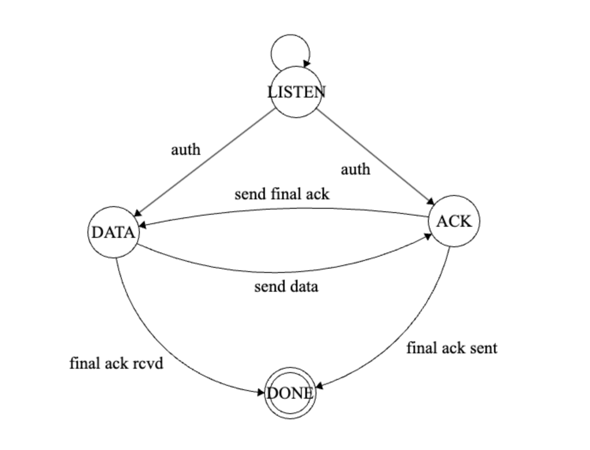

# ASP-client-server

## Running the program
- Same instructions as the sample code

1. Install dependencies with pip (requirements.txt) is provided
2. The certs in the ./certs directory are fine for testing there is a script if you want to rebuild your own but you will need openssl installed
3. run `python3 asp.py server` to start the server with defaults and `python3 asp.py client` to start the client with defaults.

## Protocol description
The code provided implements a prototype for an audio streaming protocol. The audio data to be streamed is simulated as an array of random strings with each string representing a chunk of audio of length, 5. The server sends each chunk to client along with a flag that indicates if it is the final chunk being transported. The client receives data from the server. It also simulates time using a for loop to determine when each chunk needs to be streamed or if any packets need to be dropped. When the all the messages have been streamed and the server is done sending all the messages, the client sends a final acknowledgement back to the server. Please note, the logic for the "server" (sending party) is in the file, asp_client.py and the logic for the "client" (receiving party) is the, asp_server.py. Please start the program in server mode first before running it in client mode. 

## PDU
While working on my implementation, I realized that I would need a few more fields in PDU to implement the streaming protocol. Here is my modified PDU as a C - style struct -
```
typedef struct pdu {
    int mType;
    str msg;
    int sz;
    int seq_num;
    bool is_done;
    int start;
    int end;
}
```

## DFA
The DFA specified in my design was far more advanced and contained issues. I have implemented a simpler version of this and included a picture below -  



